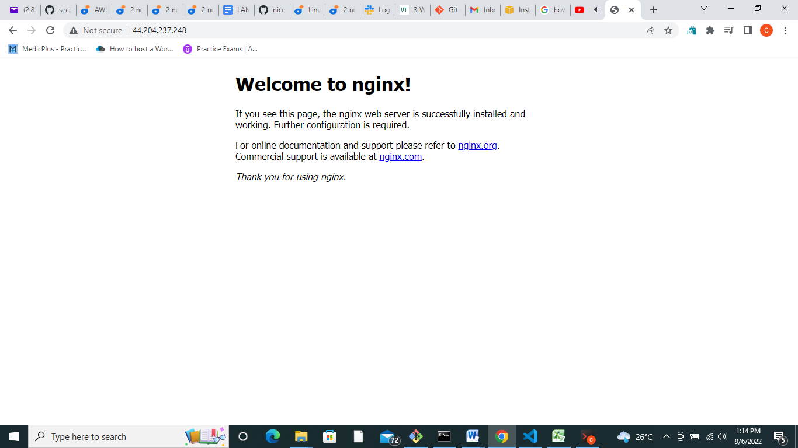
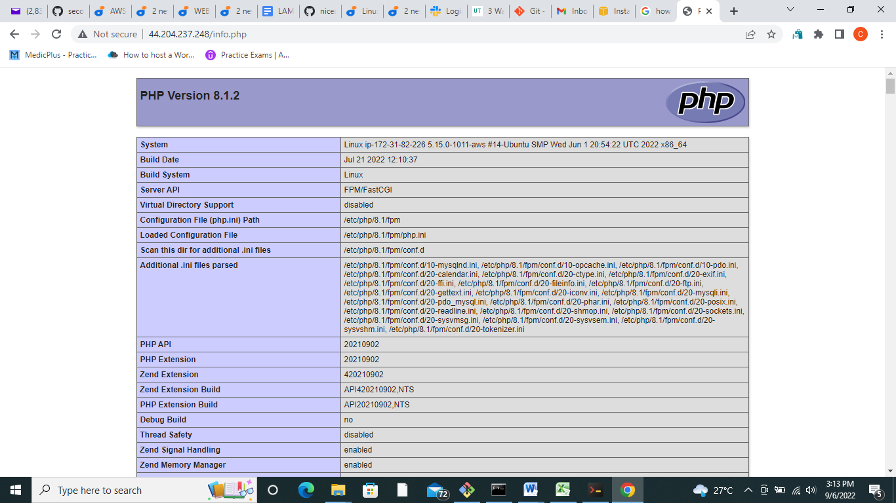
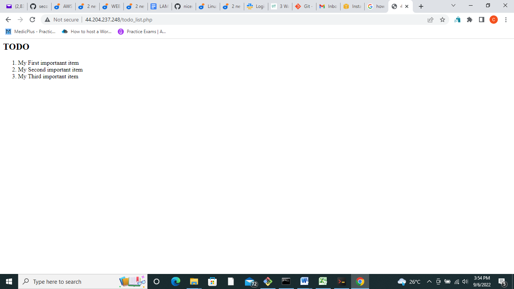

# Awesome Documentation of Project 2

## INSTALLING THE NGINX WEB SERVER

`sudo apt update`

`sudo apt install nginx`

verify that nginx was successfully installed

`sudo systemctl status nginx`

Now it is time for us to test how our Nginx server can respond to requests from the Internet.

`http://<Public-IP-Address>:80`

If you see following page, then your web server is now correctly installed and accessible through your firewall.



## INSTALLING MYSQL

`sudo apt install mysql-server`

When the installation is finished, log in to the MySQL console by typing:

`sudo mysql`

``` sql
Welcome to the MySQL monitor.  Commands end with ; or \g.
Your MySQL connection id is 11
Server version: 8.0.22-0ubuntu0.20.04.3 (Ubuntu)

Copyright (c) 2000, 2020, Oracle and/or its affiliates. All rights reserved.

Oracle is a registered trademark of Oracle Corporation and/or its
affiliates. Other names may be trademarks of their respective
owners.

Type 'help;' or '\h' for help. Type '\c' to clear the current input statement.

mysql> 
```

It’s recommended that you run a security script that comes pre-installed with MySQL. This script will remove some insecure default settings and lock down access to your database system. Before running the script you will set a password for the root user, using mysql_native_password as default authentication method. We’re defining this user’s password as PassWord.1.

`ALTER USER 'root'@'localhost' IDENTIFIED WITH mysql_native_password BY 'PassWord.1';`

Exit the MySQL shell with:

`mysql> exit`

Start the interactive script by running:

`sudo mysql_secure_installation`

This will ask if you want to configure the VALIDATE PASSWORD PLUGIN.

**Note**: Enabling this feature is something of a judgment call. If enabled, passwords which don’t match the specified criteria will be rejected by MySQL with an error. It is safe to leave validation disabled, but you should always use strong, unique passwords for database credentials.

```
VALIDATE PASSWORD PLUGIN can be used to test passwords
and improve security. It checks the strength of password
and allows the users to set only those passwords which are
secure enough. Would you like to setup VALIDATE PASSWORD plugin?

Press y|Y for Yes, any other key for No:
```

If you answer “yes”, you’ll be asked to select a level of password validation. Keep in mind that if you enter 2 for the strongest level

```
There are three levels of password validation policy:

LOW    Length >= 8
MEDIUM Length >= 8, numeric, mixed case, and special characters
STRONG Length >= 8, numeric, mixed case, special characters and dictionary              file

Please enter 0 = LOW, 1 = MEDIUM and 2 = STRONG: 1
```

If you enabled password validation, you’ll be shown the password strength for the root password

```
Estimated strength of the password: 100 
Do you wish to continue with the password provided?(Press y|Y for Yes, any other key for No) : y
```

When you’re finished, test if you’re able to log in to the MySQL console by typing:

`sudo mysql -p`

To exit the MySQL console, type:

`mysql> exit`

Notice that you need to provide a password to connect as the root user.

For increased security, it’s best to have dedicated user accounts with less expansive privileges set up for every database, especially if you plan on having multiple databases hosted on your server.

```
Note: At the time of this writing, the native MySQL PHP library mysqlnd doesn’t support caching_sha2_authentication, the default authentication method for MySQL 8. For that reason, when creating database users for PHP applications on MySQL 8, you’ll need to make sure they’re configured to use mysql_native_password instead. We’ll demonstrate how to do that in Step 6.
```

## INSTALLING PHP

`sudo apt install php-fpm php-mysql`

You now have your PHP components installed. Next, you will configure Nginx to use them.

## CONFIGURING NGINX TO USE PHP PROCESSOR

When using the Nginx web server, we can create server blocks (similar to virtual hosts in Apache) to encapsulate configuration details and host more than one domain on a single server. In this guide, we will use **projectLEMP** as an example domain name.

Create the root web directory for **your_domain** as follows:

`sudo mkdir /var/www/projectLEMP`

Next, assign ownership of the directory with the $USER environment variable, which will reference your current system user:

`sudo chown -R $USER:$USER /var/www/projectLEMP`

Then, open a new configuration file in Nginx’s `sites-available` directory using your preferred command-line editor. Here, we’ll use `nano`:

`sudo nano /etc/nginx/sites-available/projectLEMP`

This will create a new blank file. Paste in the following bare-bones configuration:

```
#/etc/nginx/sites-available/projectLEMP

server {
    listen 80;
    server_name projectLEMP www.projectLEMP;
    root /var/www/projectLEMP;

    index index.html index.htm index.php;

    location / {
        try_files $uri $uri/ =404;
    }

    location ~ \.php$ {
        include snippets/fastcgi-php.conf;
        fastcgi_pass unix:/var/run/php/php8.1-fpm.sock;
     }

    location ~ /\.ht {
        deny all;
    }

}
```

Save and close

Activate your configuration by linking to the config file from Nginx’s `sites-enabled` directory:

`sudo ln -s /etc/nginx/sites-available/projectLEMP /etc/nginx/sites-enabled/`

This will tell Nginx to use the configuration next time it is reloaded. You can test your configuration for syntax errors by typing:

`sudo nginx -t`

You shall see following message:

```
nginx: the configuration file /etc/nginx/nginx.conf syntax is ok
nginx: configuration file /etc/nginx/nginx.conf test is successful
```

If any errors are reported, go back to your configuration file to review its contents before continuing.

We also need to disable default Nginx host that is currently configured to listen on port 80, for this run:

`sudo unlink /etc/nginx/sites-enabled/default`

When you are ready, reload Nginx to apply the changes:

`sudo systemctl reload nginx`

Your new website is now active, but the web root /var/www/projectLEMP is still empty. Create an index.html file in that location so that we can test that your new server block works as expected:

```
sudo echo 'Hello LEMP from hostname' $(curl -s http://169.254.169.254/latest/meta-data/public-hostname) 'with public IP' $(curl -s http://169.254.169.254/latest/meta-data/public-ipv4) > /var/www/projectLEMP/index.html
```

Now go to your browser and try to open your website URL using IP address:

`http://<Public-IP-Address>:80`

You can leave this file in place as a temporary landing page for your application until you set up an `index.php` file to replace it. Once you do that, remember to remove or rename the `index.html` file from your document root, as it would take precedence over an `index.php` file by default.

## TESTING PHP WITH NGINX

At this point, your LAMP stack is completely installed and fully operational.

You can test it to validate that Nginx can correctly hand `.php` files off to your PHP processor.

You can do this by creating a test PHP file in your document root. Open a new file called `info.php` within your document root in your text editor:

`sudo nano /var/www/projectLEMP/info.php`

Type or paste the following lines into the new file. This is valid PHP code that will return information about your server:

``` php
<?php
phpinfo();
```

You can now access this page in your web browser by visiting the domain name or public IP address you’ve set up in your Nginx configuration file, followed by `/info.php`:

`http://`server_domain_or_IP`/info.php`



After checking the relevant information about your PHP server through that page, it’s best to remove the file you created as it contains sensitive information about your PHP environment and your Ubuntu server. You can use `rm` to remove that file:

`sudo rm /var/www/your_domain/info.php`

## RETRIEVING DATA FROM MYSQL DATABASE WITH PHP

We will create a database named **example_database** and a user named **example_user**, but you can replace these names with different values.

First, connect to the MySQL console using the **root** account:

`sudo mysql`

To create a new database, run the following command from your MySQL console:

``` sql
mysql> CREATE DATABASE `example_database`;
```

Now you can create a new user and grant him full privileges on the database you have just created.

The following command creates a new user named `example_user`, using mysql_native_password as default authentication method. We’re defining this user’s password as `password`, but you should replace this value with a secure password of your own choosing.

``` sql
mysql>  CREATE USER 'example_user'@'%' IDENTIFIED WITH mysql_native_password BY 'password';
```

Now we need to give this user permission over the `example_database` database:

`mysql> GRANT ALL ON example_database.* TO 'example_user'@'%';`

This will give the `example_user` user full privileges over the `example_database` database, while preventing this user from creating or modifying other databases on your server.

Now exit the MySQL shell with:

`mysql> exit`

You can test if the new user has the proper permissions by logging in to the MySQL console again, this time using the custom user credentials:

`mysql -u example_user -p`

Notice the `-p` flag in this command, which will prompt you for the password used when creating the `example_user` user. After logging in to the MySQL console, confirm that you have access to the `example_database` database:

`mysql> SHOW DATABASES;`

This will give you the following output:

```
Output
+--------------------+
| Database           |
+--------------------+
| example_database   |
| information_schema |
+--------------------+
2 rows in set (0.000 sec)
```

Next, we’ll create a test table named **todo_list**. From the MySQL console, run the following statement:

```
CREATE TABLE example_database.todo_list (
mysql>     item_id INT AUTO_INCREMENT,
mysql>     content VARCHAR(255),
mysql>     PRIMARY KEY(item_id)
mysql> );
```

Insert a few rows of content in the test table. You might want to repeat the next command a few times, using different VALUES:

`mysql> INSERT INTO example_database.todo_list (content) VALUES ("My first important item");`

To confirm that the data was successfully saved to your table, run:

`mysql>  SELECT * FROM example_database.todo_list;`

You’ll see the following output:

```
Output
+---------+--------------------------+
| item_id | content                  |
+---------+--------------------------+
|       1 | My first important item  |
|       2 | My second important item |
|       3 | My third important item  |
|       4 | and this one more thing  |
+---------+--------------------------+
4 rows in set (0.000 sec)
```

After confirming that you have valid data in your test table, you can exit the MySQL console:

mysql> exit

Now you can create a PHP script that will connect to MySQL and query for your content. Create a new PHP file in your custom web root directory using your preferred editor. We’ll use vi for that:

`nano /var/www/projectLEMP/todo_list.php`

The following PHP script connects to the MySQL database and queries for the content of the **todo_list** table, displays the results in a list. If there is a problem with the database connection, it will throw an exception.

Copy this content into your `todo_list`.php script:

```
<?php
$user = "example_user";
$password = "password";
$database = "example_database";
$table = "todo_list";

try {
  $db = new PDO("mysql:host=localhost;dbname=$database", $user, $password);
  echo "<h2>TODO</h2><ol>";
  foreach($db->query("SELECT content FROM $table") as $row) {
    echo "<li>" . $row['content'] . "</li>";
  }
  echo "</ol>";
} catch (PDOException $e) {
    print "Error!: " . $e->getMessage() . "<br/>";
    die();
}
```

Save and close the file when you are done editing.

You can now access this page in your web browser by visiting the domain name or public IP address configured for your website, followed by `/todo_list.php`:

`http://<Public_domain_or_IP>/todo_list.php`

You should see a page like this, showing the content you’ve inserted in your test table:



That means your PHP environment is ready to connect and interact with your MySQL server.

Congratulations!